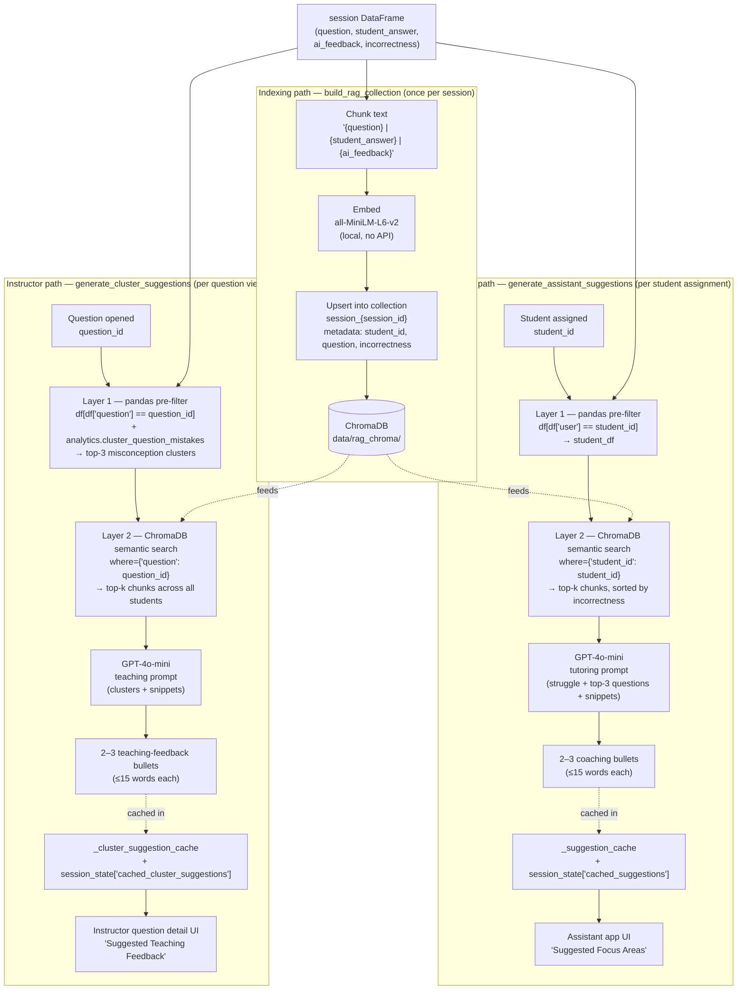

# RAG Architecture

## Concept: Dr. Batmaz's Hybrid Design

Hybrid RAG combining structured pre-filtering with ChromaDB vector search.
Described as "very innovative" — fewer pipeline steps than standard RAG.
![[Pasted image 20260414004425.png]]

### How it works

The same ChromaDB collection feeds **two query paths** — one for the assistant app (`generate_assistant_suggestions`, filters by `student_id`) and one for the instructor dashboard (`generate_cluster_suggestions`, filters by `question` and is fed by the mistake-cluster analytics). Both are implemented in [[rag.py — RAG Engine and ChromaDB Interface]].



Both paths reuse `build_rag_collection` and the same `_get_openai_client()` from `analytics.py`. Caches are cleared together on session change via `clear_suggestion_cache()` / `clear_cluster_suggestion_cache()`.

See [[RAG Pipeline - Two-Layer Retrieval]] for the code-level walk-through of the assistant path, and [[Phase 9 RAG Suggested Feedback for Question Clusters]] for the instructor cluster-feedback path.

### Layer 1 — Structured Pre-filter

```python
student_df = df[df["user"] == student_id]
```

Conceptually the "SQL" step from Dr. Batmaz's design. Implemented as a pandas filter since the session data is already in-memory; the SQL framing is retained in the dissertation as the architectural concept.

### Layer 2 — ChromaDB Vector Search

- Embed: Q&A data, AI feedback strings, incorrectness scores
- Metadata filters: `student_id`, `question`, `incorrectness`
- Flow: pre-filter → ChromaDB semantic search → LLM recommendation
- Store: `chromadb.PersistentClient` at `data/rag_chroma/`
- Collection naming: `session_{session_id}`
- Embedding model: `all-MiniLM-L6-v2` (sentence-transformers, local, no API cost)

See [[rag.py — RAG Engine and ChromaDB Interface]] for implementation.

## Reference Videos (watched)

- https://youtu.be/QSW2L8dkaZk
- https://youtu.be/cm2Ze2n9lxw

## Credit

Dr. Batmaz designed this architecture — must be acknowledged in dissertation.

## Completed Actions

- [x] Install chromadb, add to requirements.txt
- [x] Build pre-filter layer from session data (pandas `df[df["user"] == student_id]`)
- [x] Build ChromaDB collection, embed Q&A + feedback strings
- [x] Wire LLM recommendation output (GPT-4o-mini, 2–3 bullet points)
- [ ] Write dissertation justification
- [ ] Add RAG + ChromaDB literature review subsection
