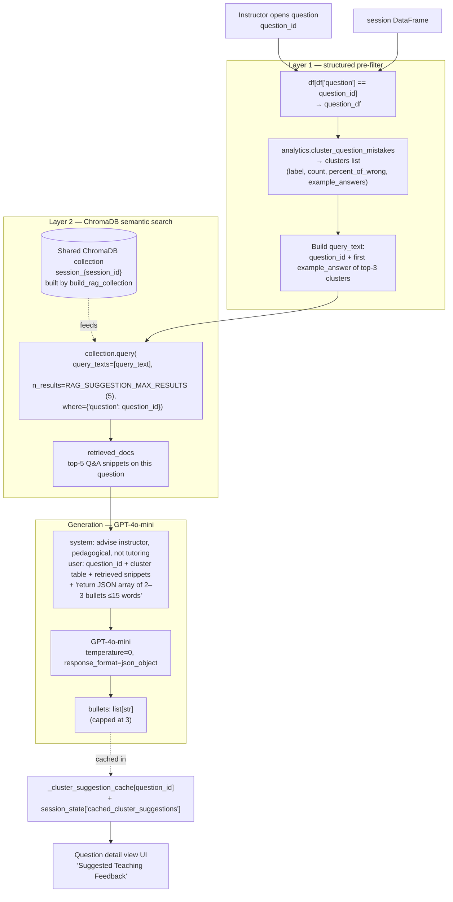

# Phase 9: RAG Suggested Feedback for Question Clusters

Sibling to [[Phase 9 RAG Suggested Feedback for Lab Assistants]]. Same RAG pipeline, re-aimed at the **instructor** rather than the lab assistant, and keyed on the **question** rather than the student.

## Connections
- [[OpenAI SDK Dependency]] — `references` [EXTRACTED]
- [[RAG Architecture — Hybrid SQL+ChromaDB Design]] — `references` [EXTRACTED]
- [[Phase 9 RAG Suggested Feedback for Lab Assistants]] — sibling feature sharing the same Chroma collection
- [[Phase 9 Testing Guide — RAG Suggested Feedback]] — manual verification steps (extended with instructor-side tests)

---

## Purpose

On the instructor's **Question Drill-Down** view (`ui.views.question_detail_view`), after the mistake-cluster cards render, produce 2–3 bullet points of **pedagogical guidance**: what misconception each cluster reveals, and what corrective feedback or follow-up the instructor should give to the class.

Audience is the instructor, not a tutor. Bullets should suggest teaching adjustments (re-explanation, worked example, quick check-question) — not one-on-one coaching.

---

## Architecture

Same two-layer hybrid as [[RAG Architecture — Hybrid SQL+ChromaDB Design]]:

- **Layer 1 — pandas pre-filter** by `question == question_id` (SQL concept, pandas implementation).
- **Layer 2 — ChromaDB semantic search** against the **same** collection built by `build_rag_collection`, filtered on the `question` metadata key. The collection metadata was already indexed by `{student_id, question, incorrectness}`, so no schema change is needed — we simply swap which metadata key we filter on.
- **Generation** — one `GPT-4o-mini` call per question summarising the top 3 clusters. Per-cluster calls would 3× the cost and produce redundant output.

---

## Data flow



Shares the ChromaDB collection with the assistant-side RAG ([[Phase 9 RAG Suggested Feedback for Lab Assistants]]) — only the `where=` filter differs (`question` vs `student_id`). See [[RAG Architecture — Hybrid SQL+ChromaDB Design]] for the combined view of both paths.

---

## Public API

Both live in [code/learning_dashboard/rag.py](../../code/learning_dashboard/rag.py).

```python
def generate_cluster_suggestions(
    question_id: str,
    df: Any,                 # full session DataFrame
    clusters: list[dict],    # output of analytics.cluster_question_mistakes
    session_id: str,
) -> list[str]:
    """Returns 2–3 pedagogical bullets. Returns [] silently on any error."""

def clear_cluster_suggestion_cache() -> None:
    """Wipe _cluster_suggestion_cache. Call on session change."""
```

Cluster dicts must contain `label`, `count`, `percent_of_wrong`, `example_answers` — the exact shape produced by `analytics.cluster_question_mistakes`.

---

## Caching and invalidation

- **Module-level**: `_cluster_suggestion_cache: dict[str, list[str]]` keyed by `question_id`. Independent from the student-side `_suggestion_cache` so navigating between student-detail and question-detail views does not cross-invalidate.
- **Session-level**: UI tracks `st.session_state["_rag_cluster_session_id"]`. When it differs from the resolved current id — `st.session_state["loaded_session_id"]` if a saved session is being viewed, otherwise `lab_state.read_state()["session_code"]` — both `rag.clear_cluster_suggestion_cache()` and `st.session_state["cached_cluster_suggestions"]` are wiped.
- The shared Chroma collection (`_collection`, `_cached_session_id`, `_cached_row_count`) is still owned by `build_rag_collection` and shared with the student-side RAG — both UI entry points should call their respective cache-clearers in concert on a true session change.

> **Fix note (2026-04-14):** both this block and the sibling `assistant_app.py` block originally read `lab_data["session_id"]`, a key that `lab_state` never populates — so the comparison always matched `""` and cache invalidation was dormant. The correct keys are `session_code` (live) and `loaded_session_id` (saved-session viewing).

---

## UI placement

`code/learning_dashboard/ui/views.py` — `question_detail_view`, inside the existing `else:` branch after `components.render_mistake_clusters(clusters)`. Purple uppercase `h4` heading `SUGGESTED TEACHING FEEDBACK` followed by plain markdown bullets `• {text}`.

Silent no-op when the bullet list is empty (deps missing, LLM failure, or low-data question).

---

## Gating

The RAG block is only reached when:

1. `"incorrectness"` column is present on the frame.
2. `wrong_count >= config.CLUSTER_MIN_WRONG` — otherwise the existing info message handles it.
3. `clusters` is a non-empty list — otherwise the info message handles it.

Inside `generate_cluster_suggestions` it further returns `[]` when:

4. `len(question_df) < config.RAG_MIN_SUBMISSIONS`.
5. `build_rag_collection(...)` returns `None` (missing chromadb / sentence-transformers).
6. Any exception is raised — logged at `logger.debug` level, UI shows nothing.

---

## Config reuse

No new constants. Reused:

| Constant | Purpose |
|---|---|
| `RAG_SUGGESTION_MAX_RESULTS` (5) | top-k retrieved snippets |
| `RAG_MIN_SUBMISSIONS` (2) | minimum rows for the question to qualify |
| `OPENAI_MODEL` (`gpt-4o-mini`) | generation model |
| `CLUSTER_MIN_WRONG` | upstream gate (set by the clustering feature itself) |

Magic local constant: top-3 clusters summarised in the prompt (hard-coded inside `generate_cluster_suggestions`).

---

## Prompt template (verbatim)

System message:

> You advise a university instructor on how to correct common misconceptions about a specific question. Focus on teaching adjustments and corrective feedback to give the class — not one-on-one tutoring.

User message:

```
Question: {question_id}

Mistake clusters (top 3):
  [1] {label} — {count} students ({percent_of_wrong}% of wrong). Examples: {e1}; {e2}
  [2] ...
  [3] ...

Retrieved Q&A snippets:
  - {snippet1}
  - {snippet2}
  ...

Return a JSON array of 2 or 3 short bullet strings (max 15 words each) with
pedagogical advice: what misconception each cluster reveals and what feedback
or follow-up the instructor should give. No prose outside the array.
```

Response parsing mirrors `generate_assistant_suggestions` — accepts a bare JSON array **or** a `{bullets|suggestions|items|result: [...]}` object, then falls back to harvesting any string values.

---

## Reconstruction checklist

If the code is lost, rebuild by:

1. In `rag.py`, add module global `_cluster_suggestion_cache` + two public functions above (`generate_cluster_suggestions`, `clear_cluster_suggestion_cache`). Reuse `build_rag_collection`, `_get_openai_client`, `config.*`, `logger`.
2. In `ui/views.py`, extend the top-of-file import to include `lab_state, rag`. In `question_detail_view`, inside the `else:` branch that already calls `render_mistake_clusters`, append the session-change guard + cache + spinner + bullet render shown in the UI placement section above. **Resolve the session id as** `str(st.session_state.get("loaded_session_id") or lab_state.read_state().get("session_code") or "")` — *not* `session_id` (that key does not exist in `lab_state`).
3. No config, no new tests, no new components. Cluster dicts already carry every field the prompt needs.
4. Verify per [[Phase 9 Testing Guide — RAG Suggested Feedback]] **Tests 10–13** (instructor-side additions).

