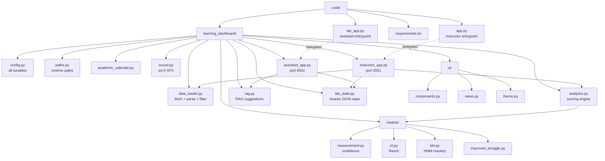

# Source Tree Index

A structural, file-by-file reference that mirrors the real `code/` directory on disk. Use this alongside the thematic notes in [[Lab App]], [[Assistant App]], [[Overview Index]], and [[Reference Index]] — this section answers *"what does this file do?"* while the thematic notes answer *"how does this feature work?"*.

---

## Diagram

Solid arrows are `contains`; dotted arrows are `delegates to` / `depends on` (not exhaustive — just the load-bearing wires).

---

## Top-level `code/`

| File | One-line summary |
|------|------------------|
| [[code]] | Repo-level entry folder — holds the two Streamlit wrappers and the `learning_dashboard/` package. |
| [[app]] | Instructor dashboard wrapper → delegates to `instructor_app.main()`. Runs on port 8501. |
| [[lab_app]] | Lab assistant mobile wrapper → delegates to `assistant_app.main()`. Runs on port 8502. |
| [[requirements]] | Pinned Python dependencies — Streamlit, Plotly, Pandas, OpenAI, scikit-learn, ChromaDB, sentence-transformers. |

## Core package — `code/learning_dashboard/`

See [[learning_dashboard]] for the folder overview.

| File | One-line summary |
|------|------------------|
| [[__init__]] | Package marker. |
| [[config]] | All tunable constants — weights, thresholds, API URL, model toggles, colours. |
| [[paths]] | Resolves runtime paths (`data/`, saved sessions, lab-session JSON, ChromaDB). Legacy-file migration. |
| [[academic_calendar]] | Maps dates → Loughborough 2025/26 academic period labels. |
| [[data_loader]] | API fetch, JSON/XML parsing, normalisation, filters, saved-session persistence. |
| [[analytics]] | Scoring engine — incorrectness, struggle, difficulty, CF, mistake clustering. |
| [[rag]] | Two-layer RAG for lab-assistant coaching suggestions (pandas pre-filter + ChromaDB). |
| [[lab_state]] | File-locked JSON state shared by instructor and assistant apps. |
| [[sound]] | Sci-fi SFX via Web Audio API injected into Streamlit. |
| [[instructor_app]] | Instructor dashboard entrypoint — sidebar, routing, state init. |
| [[assistant_app]] | Assistant mobile app entrypoint — four-state join/assign/helped flow. |

## Presentation layer — `code/learning_dashboard/ui/`

See [[ui]] for the folder overview.

| File | One-line summary |
|------|------------------|
| [[components]] | Reusable Streamlit UI blocks — header, cards, leaderboards, charts. |
| [[views]] | Page-level layouts for each instructor view. |
| [[theme]] | Sci-fi neon CSS (desktop) and mobile CSS (lab app) + Plotly layout defaults. |

## Advanced models — `code/learning_dashboard/models/`

See [[models]] for the folder overview.

| File | One-line summary |
|------|------------------|
| [[measurement]] | Adds a confidence score to AI-estimated incorrectness. |
| [[irt]] | 1-PL Rasch IRT for data-driven question difficulty. |
| [[bkt]] | Bayesian Knowledge Tracing for per-question mastery. |
| [[improved_struggle]] | Difficulty-adjusted struggle combining behavioural + mastery + difficulty signals. |

---

See also: [[Code Index]] · [[Architecture]] · [[Data Pipeline]] · [[Analytics Engine]]
